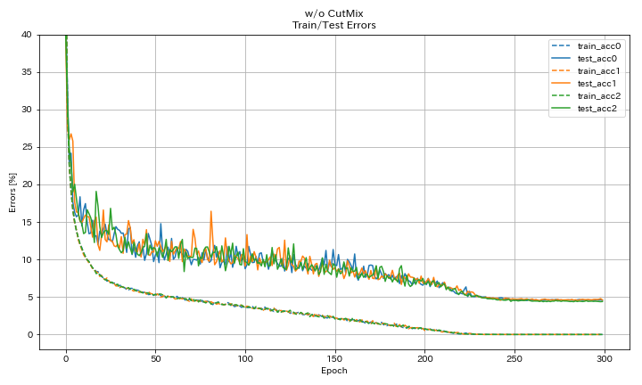

# PyTorch Implementation of CutMix


## Usage

```
$ python train.py --depth 20 --use_cutmix --outdir results
```


## Results on CIFAR-10

| Model                      | Test Error (median of 3 runs) | Training Time |
|:---------------------------|:-----------------------------:|--------------:|
| WRN-20-4                   |             4.56              |    1h22m      |
| WRN-20-4, CutMix (alpha=1) |             3.62              |    1h22m      |

* These models were trained for 300 epochs with batch size 128, initial learning rate 0.2, and cosine annealing.
* Test errors reported above are of the last epoch.
* These experiments were done using Tesla V100.


### w/o CutMix

```bash
$ python -u train.py --depth 20 --base_channels 64 --base_lr 0.2 --scheduler cosine --seed 7 --outdir results/wo_cutmix/00
```




### w/ CutMix

```bash
$ python -u train.py --depth 20 --base_channels 64 --base_lr 0.2 --scheduler cosine --seed 7 --use_cutmix --cutmix_alpha 1.0 --outdir results/w_cutmix/00
```


## References

* Yun, Sangdoo, Dongyoon Han, Seong Joon Oh, Sanghyuk Chun, Junsuk Choe, and Youngjoon Yoo. "CutMix: Regularization Strategy to Train Strong Classifiers with Localizable Features." arXiv preprint arXiv:1905.04899 (2019). [arXiv:1905.04899](https://arxiv.org/abs/1905.04899)


